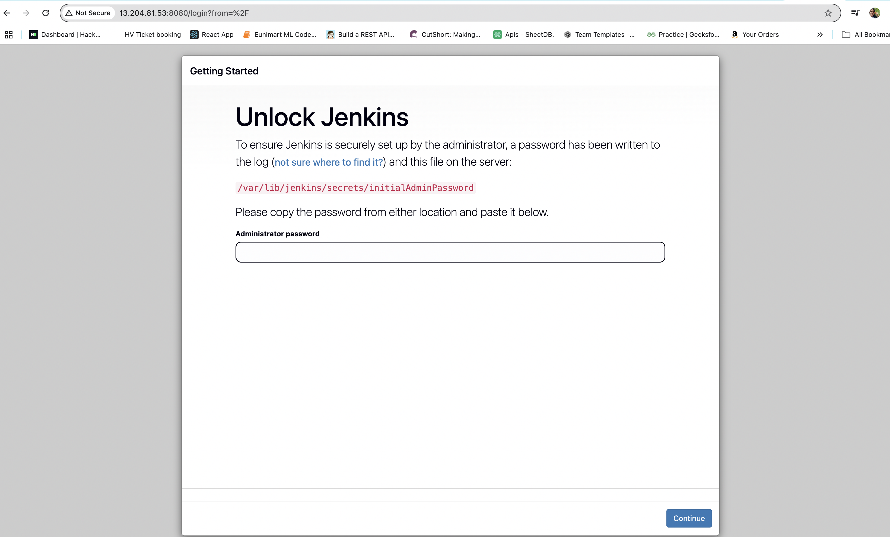
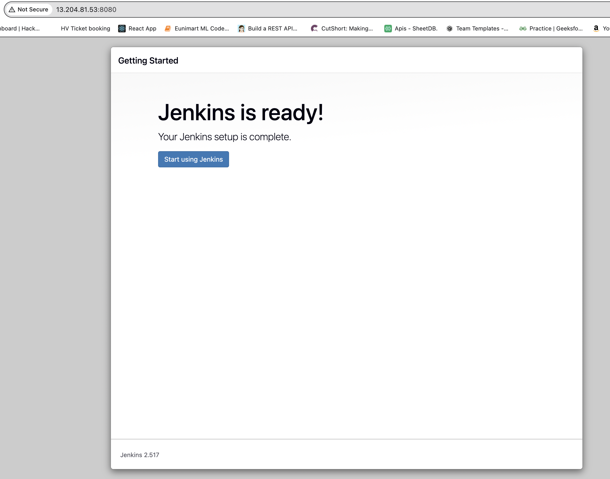
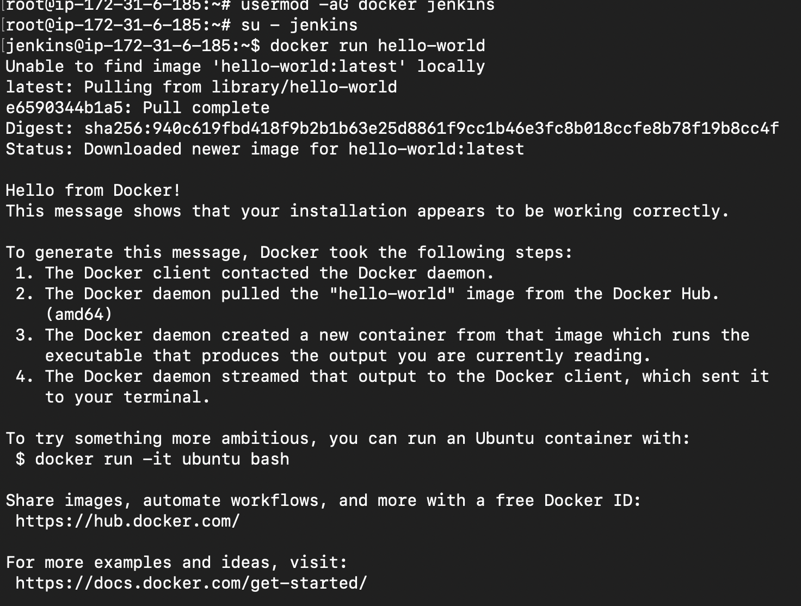

## Jenkins 
It is an open source automation server used to implement Continuous Integration and Continuous Delivery (CI/CD) pipelines.

## 🚀 Jenkins Setup on AWS EC2
I launched an Amazon EC2 instance and installed Jenkins to enable Continuous Integration and Continuous Delivery (CI/CD) for my projects.

## 🔧 Jenkins Installation Summary:
Jenkins was successfully installed and is running on port 8080. Below is a sample output from the installation process:

$ sudo apt update
$ sudo apt install openjdk-11-jdk
$ wget -q -O - https://pkg.jenkins.io/debian-stable/jenkins.io.key | sudo apt-key add -
$ sudo sh -c 'echo deb https://pkg.jenkins.io/debian-stable binary/ > \
    /etc/apt/sources.list.d/jenkins.list'
$ sudo apt update
$ sudo apt install jenkins

# Jenkins is running at http://13.204.81.53:8080/

# Docker Slave Configuration and granted user permission to docker deamon

$ sudo apt update
$ sudo apt install docker.io
$ sudo su - 
$ usermod -aG docker jenkins
$ usermod -aG docker ubuntu
$ systemctl restart docker

